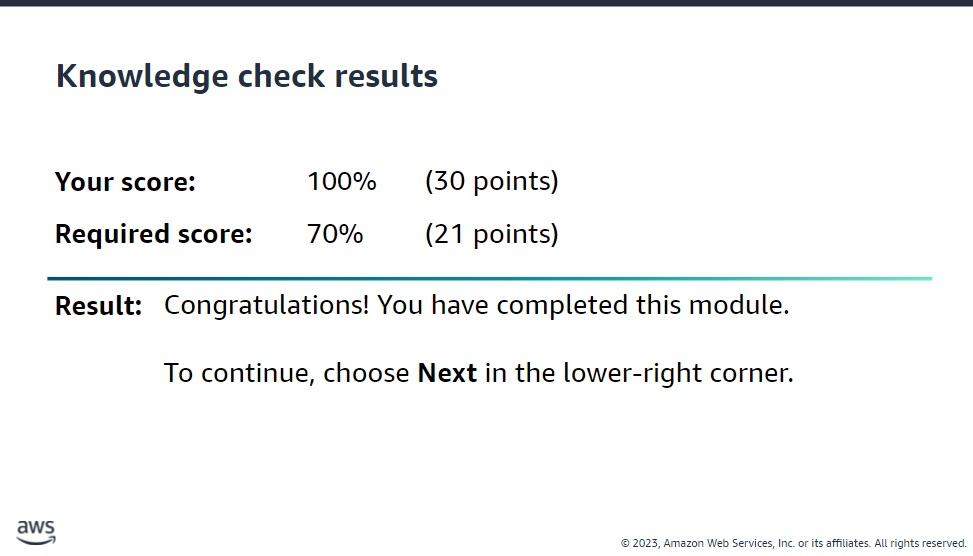
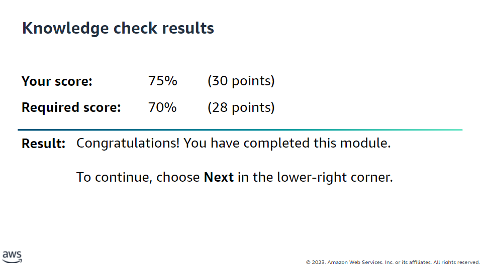
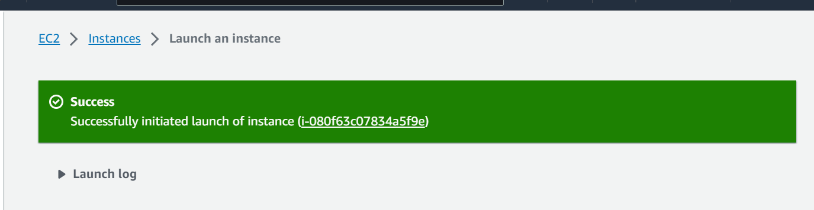
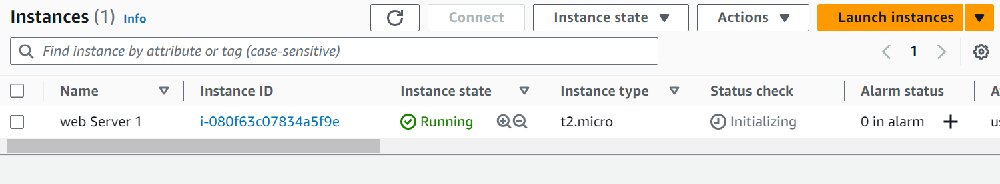
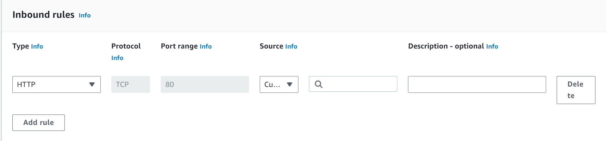
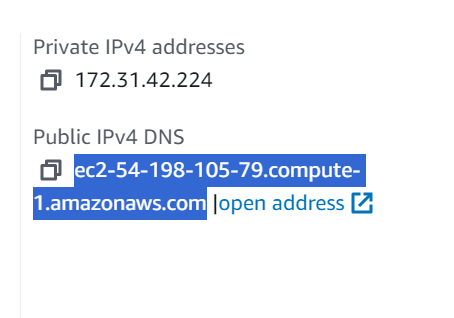
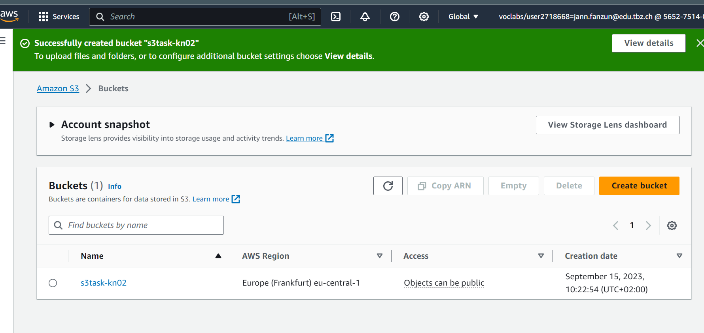
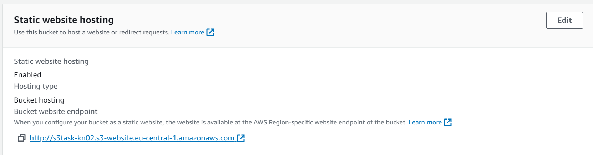
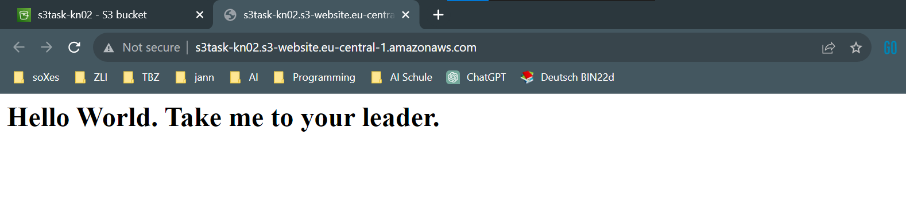

# AWS Kurs 
---
## Ausgangslage
- Die Ausgangslage besteht aus vier Modulen, wovon die ersten drei informativ sind und schnell durchgegangen werden sollen.
- Das vierte Modul beinhaltet praktische Übungen mit EC2 (virtuelle Maschinen) und S3 (Storage Buckets).
- Öffnen Sie den Kurs "AWS Academy Introduction to Cloud: Semester 1".
- Bearbeiten Sie die ersten 4 Module (Global Infrastructure, Structures of the Cloud, AWS Console, Virtual Servers).
- Die Knowledge Checks in diesen Modulen müssen nicht zwingend durchgeführt werden.
- Im Modul 4 gibt es zwei Kapitel: "Lab 4.1 - EC2" und "Lab 4.2 - S3".
- Führen Sie beide Labs durch und achten Sie auf die Leistungsnachweise in den Details.
---
### Global Infrastructure

#### Technologiebegriffe
- **Cloud Computing**: On-Demand-Bereitstellung von IT-Ressourcen über das Internet mit pay-as-you-go Preisen.
- **AWS (Amazon Web Services)**: Plattform für Cloud-Computing-Dienste.
- **Cloud-Speicher**: Daten speichern über Cloud-Service-Provider statt physischer Maschinen.
- **Server**: Computer zur Datenverarbeitung und Bereitstellung über das Internet.

#### Hintergrund
- Nutzung von Cloud Computing für Online-Arbeit und Datenspeicherung.
- Geschäftsvorteile: Kosten, Skalierbarkeit, Flexibilität, Wartung, weltweite Erreichbarkeit.

#### Cloud-Service-Typen
- IaaS: Rechenleistung, Netzwerk, Speicher (z.B. Amazon EC2).
- PaaS: Tools zur Anwendungs- und Programm-Entwicklung (z.B. AWS Elastic Beanstalk).
- SaaS: Online-Anwendungen und -Programme (z.B. Dropbox, Microsoft Office 365).

##### Test

### Structures of the Cloud

**Strukturen der Cloud**

In der Cloud können Ressourcen und Dienste in verschiedenen Strukturen organisiert werden, um den Anforderungen einer Organisation gerecht zu werden. Hier sind einige häufig verwendete Cloud-Strukturen:

1. **Einzelne Cloud-Instanz**: In dieser Struktur wird alles in einer einzelnen Cloud-Umgebung bereitgestellt und verwaltet. Dies kann eine einfache Möglichkeit sein, mit der Cloud zu beginnen, eignet sich jedoch möglicherweise nicht für komplexe Anforderungen.

2. **Multi-Cloud**: Bei dieser Struktur werden Ressourcen und Dienste über mehrere Cloud-Anbieter verteilt. Dies kann die Vermeidung von Vendor-Lock-In und die Nutzung der Stärken verschiedener Anbieter ermöglichen.

3. **Hybrid-Cloud**: Hierbei handelt es sich um eine Kombination aus Cloud- und On-Premises-Ressourcen. Diese Struktur bietet Flexibilität und kann für Datenschutz- oder Compliance-Anforderungen relevant sein.

**Beispiel in AWS**

Ein Beispiel für die Nutzung von AWS in einer Multi-Cloud-Struktur:

Eine Organisation betreibt ihre Webanwendung auf AWS und nutzt gleichzeitig Microsoft Azure für ihre Datenanalyseanforderungen. In AWS werden EC2-Instanzen für die Webanwendung bereitgestellt, während Azure-Dienste wie Azure Data Lake und Azure Machine Learning für die Datenanalyse genutzt werden.

Diese Multi-Cloud-Struktur ermöglicht es der Organisation, die besten Ressourcen und Dienste von verschiedenen Anbietern für verschiedene Anforderungen zu nutzen, ohne sich auf einen einzelnen Cloud-Anbieter zu beschränken.

##### Test

### AWS Console

Die **AWS-Konsole** ist eine webbasierte Benutzeroberfläche, die es Benutzern ermöglicht, auf verschiedene AWS-Dienste und -Ressourcen zuzugreifen und diese zu verwalten. Mit der Konsole können Sie AWS-Ressourcen erstellen, überwachen und verwalten, ohne die Notwendigkeit von Befehlszeilentools oder API-Aufrufen.

**Beispiel**:
Um eine Amazon S3-Bucket in der AWS-Konsole zu erstellen, folgen Sie diesen Schritten:

1. Melden Sie sich in der AWS-Konsole an.
2. Navigieren Sie zum AWS S3-Dienst.
3. Klicken Sie auf "Bucket erstellen".
4. Geben Sie einen eindeutigen Namen für Ihren Bucket ein.
5. Konfigurieren Sie die gewünschten Berechtigungen und Einstellungen.
6. Klicken Sie auf "Bucket erstellen".

Die AWS-Konsole bietet eine benutzerfreundliche Möglichkeit, auf die leistungsstarken AWS-Dienste zuzugreifen und diese zu nutzen.

### Virtual Server

#### technische Begriffe
- Amazon EC2: Skalierbare Cloud-Rechenkapazität.

- Amazon S3: Cloud-Speicherdienst.

- DNS: Namenssystem für Netzwerkressourcen.

- S3-Bucket: Container für Dateien in Amazon S3.

- Richtlinie (Policy): Steuert Berechtigungen in AWS.

- Domänenname: Webadresse zur Identifikation.

- Amazon Route 53: AWS DNS-Dienst.

- VPC: Virtuelles privates Netzwerk in AWS.

### Lab 4.1 - EC2

#### launch instance

#### add inbound rule

#### web anschauen

----

### Lab 4.2 - S3

#### Storage erstellt

#### Static Webhosting

#### Im Web
