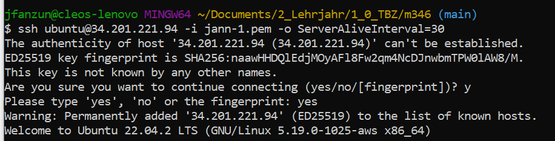
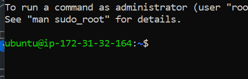
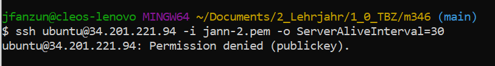

# Zugriff mit SSH-Key

## Ausgangslage

zwei Keypairs erstellen

### Unterschied Passwort und SSH
- **Passwort**:
  - Textbasierte Authentifizierung.
  - Kann leicht erraten oder geknackt werden, wenn es schwach ist.

- **SSH-Schlüssel**:
  - Kryptografisches Schlüsselpaar: öffentlicher und privater Schlüssel.
  - Sicherer als ein Passwort, da es auf komplexer Kryptographie basiert.

### Login mit jann-1.pem SSH-Key

- Wir haben der Instanz bevor wir sie gestartet haben, gesagt, dass nur der jann-1.pem funktioniert. Mit folgendem Query habe ich mich eingeloggt.

```ssh ubuntu@34.201.221.94 -i jann-1.pem -o ServerAliveInterval=30```




### Login mit jann-2.pem SSH-Key
```ssh ubuntu@34.201.221.94 -i jann-2.pem -o ServerAlive=30```
- Da wir vor dem launchen der Instanz nur den ersten (jann-1.pem) mitgegeben haben, kann ich mich nicht mit dem zweiten Schlüssel jann-2.pem auf die IP: **ubuntu@34.201.221.94** einloggen.


### Zuweisung von Key

| Nr. | Name           | Instance ID                   | Instance state | Instance type | Status check       | Alarm status | Availability Zone | Public IPv4 DNS                                | Public IPv4 address | Elastic IP | IPv6 IPs | Monitoring | Security group name | Key name | Launch time             | Platform details |
| --- | -------------- | ----------------------------- | --------------- | ------------- | ------------------- | ------------ | ----------------- | ----------------------------------------------- | ------------------ | ---------- | -------- | ---------- | -------------------- | -------- | ----------------------- | ---------------- |
| 1   | kn02-challengeB | i-0cf29fa8c4051aa33          | Running         | t2.micro       | 2/2 checks passed  | 0 in alarm   | us-east-1b       | ec2-34-201-221-94.compute-1.amazonaws.com | 34.201.221.94      | –          | –        | disabled   | launch-wizard-3     | jann-1   | 2023/09/15 10:42 GMT+2 | Linux/UNIX      |

- die drittletze Zeile zeigt, dass nur der Key **jann-1** funktioniert

