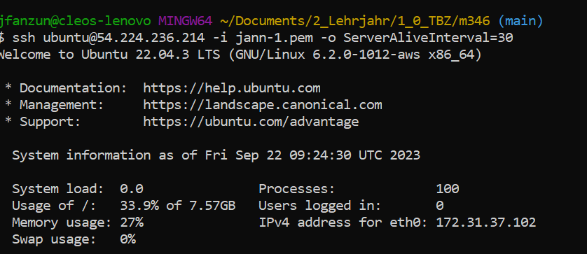
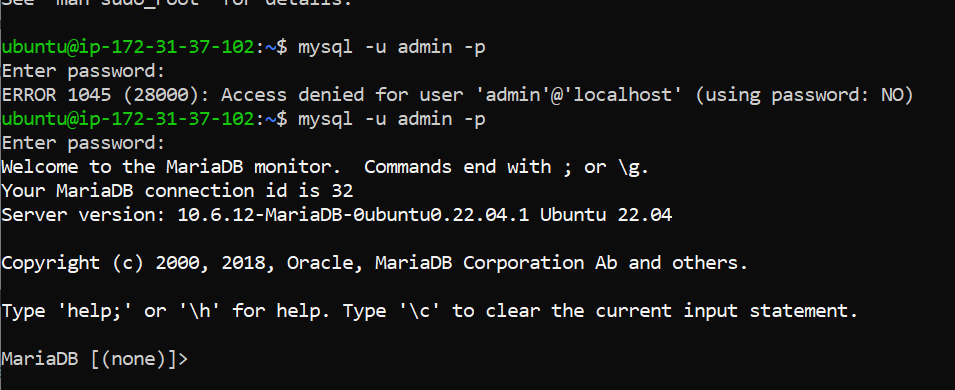
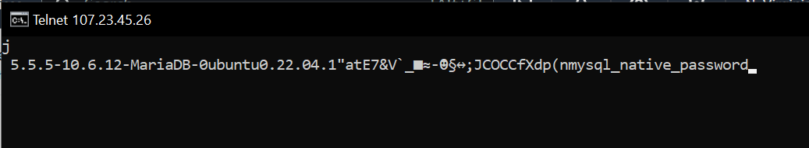
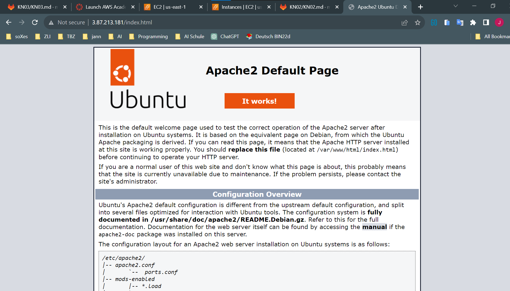
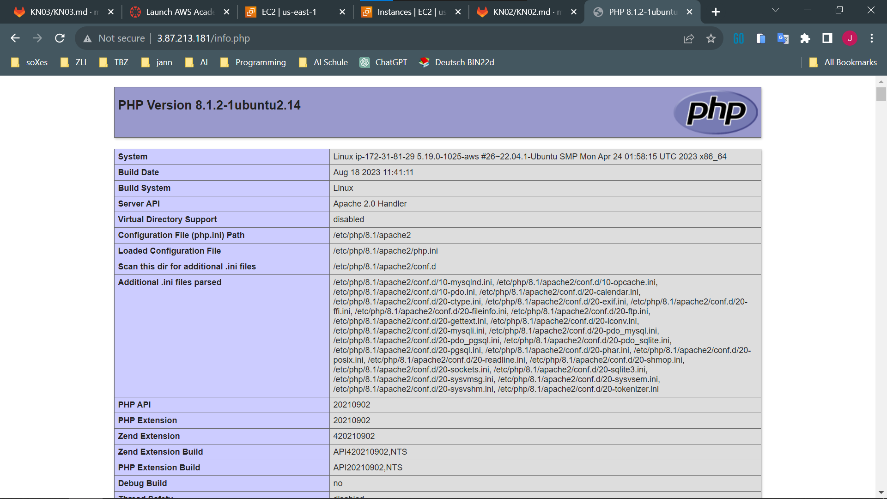
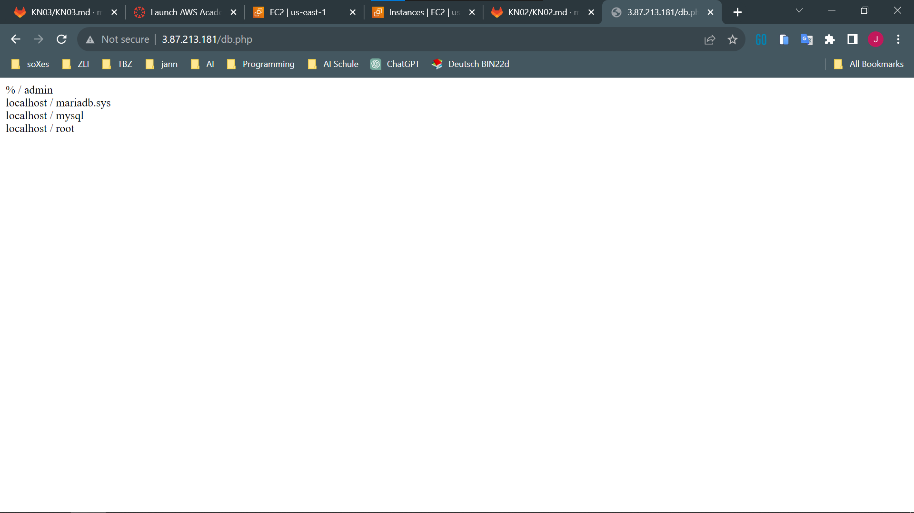
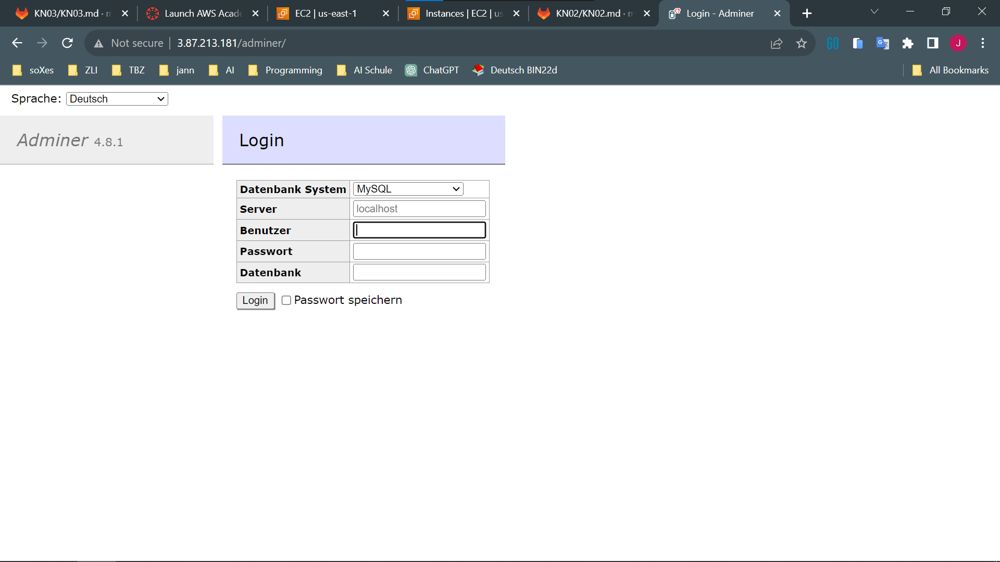
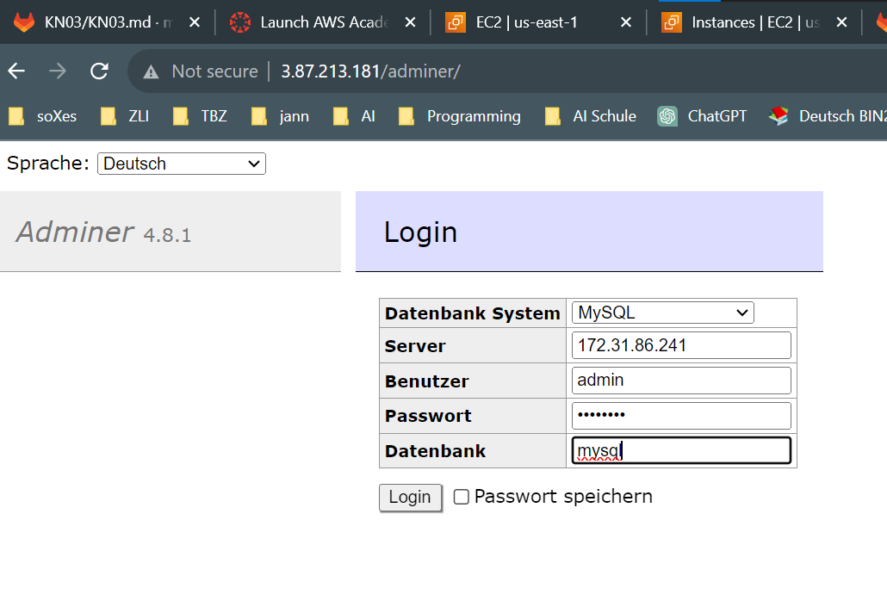
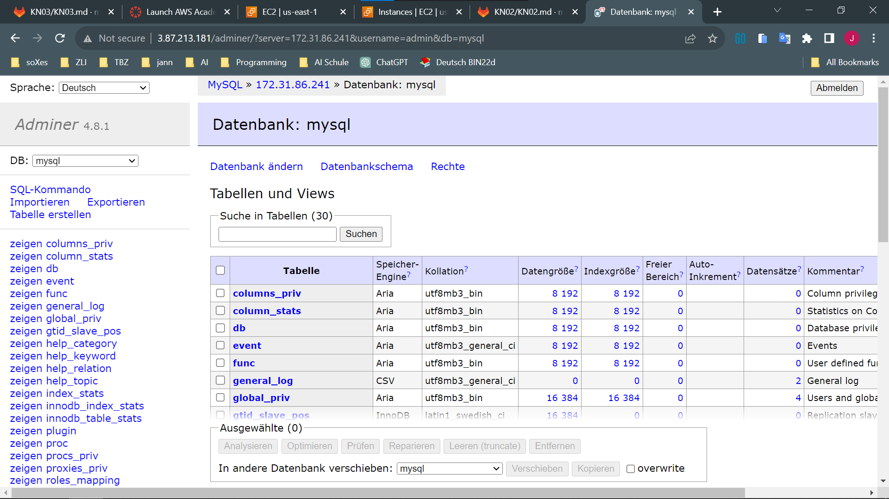

## Zum Server verbinden

``ssh ubuntu@107.23.45.26 -i jann-1.pem -o ServerAliveInterval=30``

## Zur Datenbank verbinden

``sudo mysql -u admin -p
``

**passwort** -> "password"

## Inbound Rule DB Port 3306 von mysql/aurora
| Name | Security group rule ID | IP version | Type           | Protocol | Port range | Source      | Description |
|------|------------------------|------------|----------------|----------|------------|-------------|-------------|
|      | sgr-0c5916d2613ffc637  | IPv4       | SSH            | TCP      | 22         | 0.0.0.0/0  |             |
|      | sgr-0b8f6aa793ffc37f0  | IPv4       | MYSQL/Aurora   | TCP      | 3306       | 0.0.0.0/0  |             |

## Inbound Rule Web Port 80 IPv4
| Name | Security group rule ID | IP version | Type | Protocol | Port range | Source     | Description |
|------|------------------------|------------|------|----------|------------|------------|-------------|
|      | sgr-04af459c0323730c6  | IPv4       | HTTP | TCP      | 80         | 0.0.0.0/0 |             |
|      | sgr-0f9991e36d0474763  | IPv4       | SSH  | TCP      | 22         | 0.0.0.0/0 |             |

## Verbinden zur DB mit Public IP

``telnet 107.23.45.26 3306
``

## verbinden mit index.html

**_ip muss die Public vom Web sein_**

url: http://3.87.213.181/index.html

## verbinden mit info.php
**_ip muss die Public vom Web sein_**

url: http://3.87.213.181/info.php

## verbinden mit db.php
**_ip muss die Public vom Web sein_**

url: http://3.87.213.181/db.php

## verbinden mit dem Adminer
**_ip muss die Public vom Web sein_**

- server: private Ipv4 von DB Instanz
- Benutzer: admin
- passwort: password
- datenbank: mysql

url: http://3.87.213.181/adminer/?server=172.31.86.241&username=admin&db=mysql