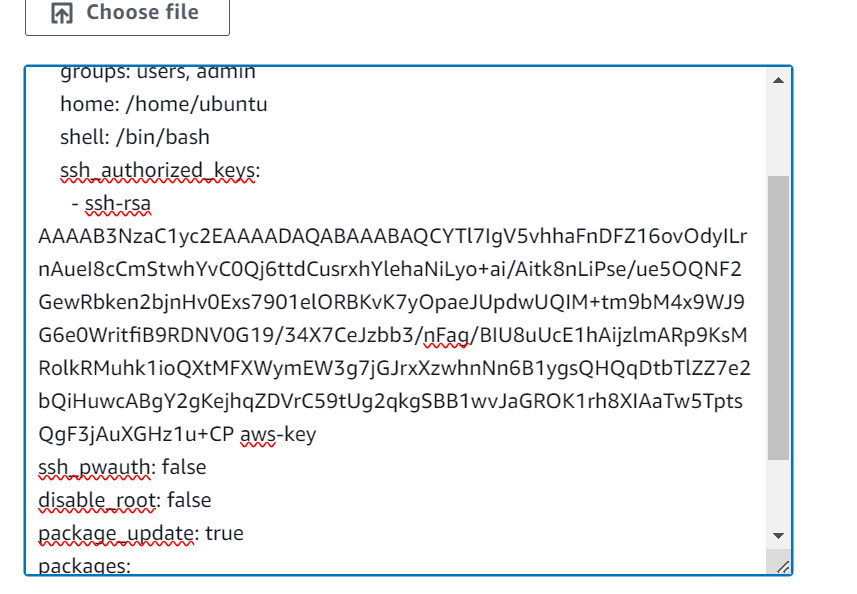
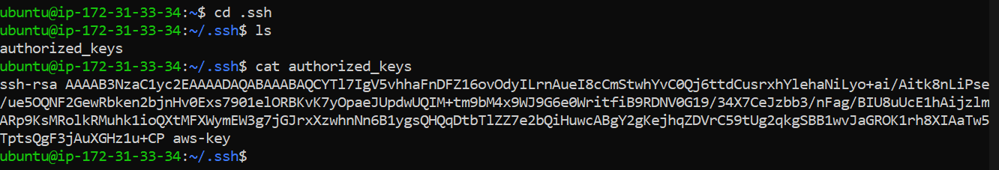
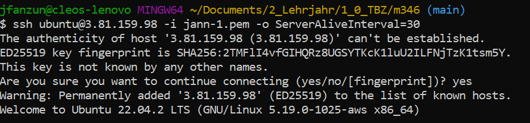
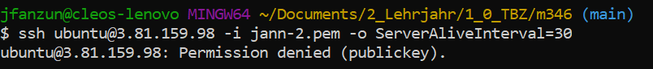
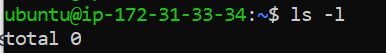
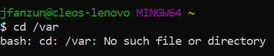

# SSH Key und Cloud init

---

### Public Key von PuTTy



### Instanz Key

| Name    | Instance ID              | Instance state | Instance type | Status check       | Alarm status | Availability Zone | Public IPv4 DNS                           | Public IPv4 address | Elastic IP | IPv6 IPs | Monitoring | Security group name | Key name | Launch time            | Platform details |
| ------- | ------------------------ | -------------- | ------------- | ------------------ | ------------ | ----------------- | ----------------------------------------- | ------------------- | ---------- | -------- | ---------- | ------------------- | -------- | ---------------------- | ---------------- |
| KN03-B  | i-011e8a6fb58beefe1     | Running        | t2.micro      | 2/2 checks passed | No alarms    | us-east-1b        | ec2-3-81-159-98.compute-1.amazonaws.com  | 3.81.159.98         | –          | –        | disabled   | launch-wizard-4     | jann-2   | 2023/09/22 09:03 GMT+2 | Linux/UNIX       |

### Verbinden mit Instanz IP

#### Welcher Schlüssel wird von welchem überschrieben?

Der erste Schlüssel überschreibt den zweiten Schlüssel - **jann-1.pem** überschreibt **jann-2.pem**
- Grund dafür ist, dass zu Beginn bei allen Einstellungen ein yaml File generiert wird - falls ich dann in den additional Features ein neues yaml File einfüge, mit einem anderen SSH Key, wird der neue SSH Key den alten überschreiben.

##### Authorized Key


##### Versuch mit jann-1
```ssh ubuntu@3.81.159.98 -i jann-1.pem -o ServerAliveInterval=30```


##### Versuch mit jann-2
```ssh ubuntu@3.81.159.98 -i jann-2.pem -o ServerAliveInterval=30```



### Cloud-init Log


- kein /var Ordner?