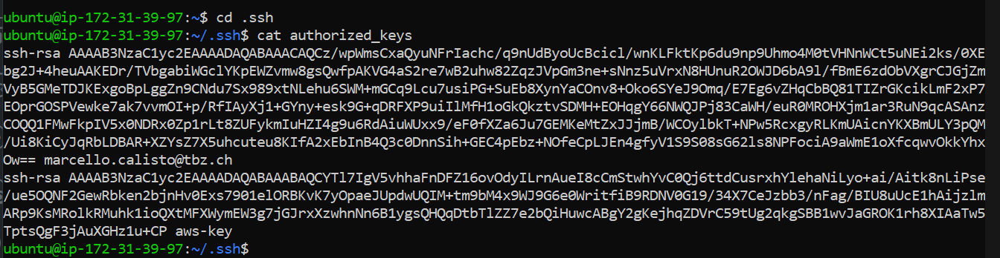
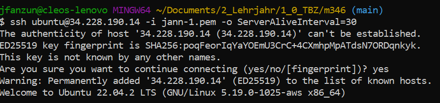

# Template
---

### Instanz
| Name    | Instance ID              | Instance state | Instance type | Status check       | Alarm status | Availability Zone | Public IPv4 DNS                           | Public IPv4 address | Elastic IP | IPv6 IPs | Monitoring | Security group name | Key name | Launch time            | Platform details |
| ------- | ------------------------ | -------------- | ------------- | ------------------ | ------------ | ----------------- | ----------------------------------------- | ------------------- | ---------- | -------- | ---------- | ------------------- | -------- | ---------------------- | ---------------- |
| KN03-C  | i-0c66bebf3169cb7c7     | Running        | t2.micro      | 2/2 checks passed | No alarms    | us-east-1b        | ec2-34-228-190-14.compute-1.amazonaws.com | 34.228.190.14        | –          | –        | disabled   | launch-wizard-5     | jann-1   | 2023/09/22 10:13 GMT+2 | Linux/UNIX       |

### Authorized Keys

### Verbinden zur Instanz
``ssh ubuntu@34.228.190.14 -i jann-1.pem -o ServerAliveInterval=30``

