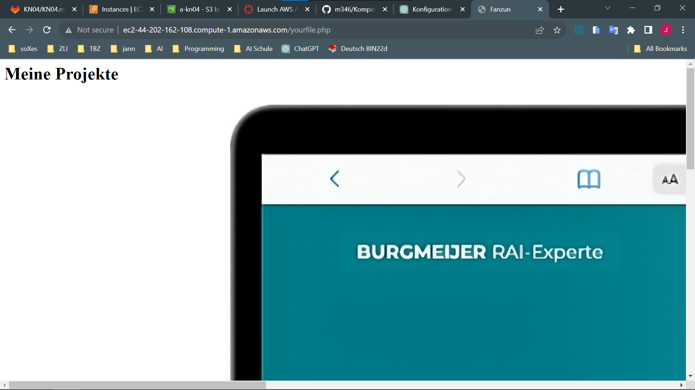

## Inbound Rule Port 80 hinzugefügt

| Name | Security group rule ID | IP version | Type | Protocol | Port range | Source | Description |
| ---- | ---------------------- | ---------- | ---- | -------- | ---------- | ------ | ----------- |
|      | sgr-0864e6b0d8357b0d0 | IPv4       | SSH  | TCP      | 22         | 0.0.0.0/0 | -           |
|      | sgr-0d92b3c1435e03c36 | IPv4       | HTTP | TCP      | 80         | 0.0.0.0/0 | -           |


## Verbinden zu EC2



url: http://ec2-44-202-162-108.compute-1.amazonaws.com/yourfile.php

## yaml File

- **Benutzerkonfiguration**:
  - Erstellt einen Benutzer "ubuntu" mit sudo-Berechtigungen.
  - Hinzufügen des öffentlichen SSH-Schlüssels für den Benutzer.
  - Deaktiviert direkte Root-Anmeldungen.

- **Paketverwaltung**:
  - Aktualisiert das Paketsystem.
  - Installiert verschiedene Pakete, einschließlich Apache2, PHP und MySQL.

- **Dateikonfiguration**:
  - Erstellt eine PHP-Infoseite.
  - Erstellt eine HTML-Seite mit einem Bild von einem S3-Bucket.

- **Webserver-Konfiguration**:
  - Aktiviert und startet den Apache-Webserver.

```#cloud-config
users:
  - name: ubuntu
    sudo: ALL=(ALL) NOPASSWD:ALL
    groups: users,sudo
    home: /home/ubuntu
    shell: /bin/bash
    ssh_authorized_keys:
      - ssh-rsa AAAAB3NzaC1yc2EAAAADAQABAAABAQCYTl7IgV5vhhaFnDFZ16ovOdyILrnAueI8cCmStwhYvC0Qj6ttdCusrxhYlehaNiLyo+ai/Aitk8nLiPse/ue5OQNF2GewRbken2bjnHv0Exs7901elORBKvK7yOpaeJUpdwUQIM+tm9bM4x9WJ9G6e0WritfiB9RDNV0G19/34X7CeJzbb3/nFag/BIU8uUcE1hAijzlmARp9KsMRolkRMuhk1ioQXtMFXWymEW3g7jGJrxXzwhnNn6B1ygsQHQqDtbTlZZ7e2bQiHuwcABgY2gKejhqZDVrC59tUg2qkgSBB1wvJaGROK1rh8XIAaTw5TptsQgF3jAuXGHz1u+CP aws-key
disable_root: true
package_update: true
packages:
  - apache2
  - php
  - libapache2-mod-php
  - mysql-server
  - php-mysql
write_files:
  - content: |
      <?php phpinfo(); ?>
    path: /var/www/html/info.php
    permissions: '0644'
  - content: |
      <?php
      $ihrname = "Fanzun";
      ?>
      <html>
      <head>
      <title><?php echo $ihrname; ?></title>
      </head>
      <body>
      <h1>Meine Projekte</h1>
      <br />
      
      </body>
      </html>
    path: /var/www/html/yourfile.php # alles wir in das php file geschrieben
    permissions: '0644'
runcmd:
  - sudo systemctl enable apache2
  - sudo systemctl start apache2
```