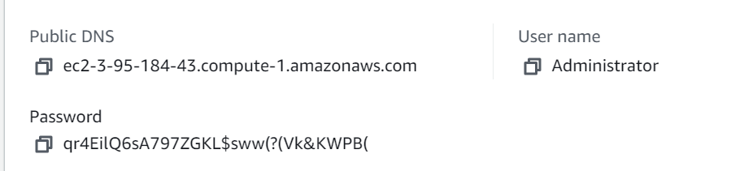
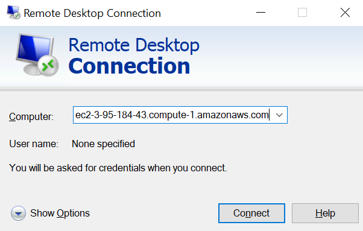
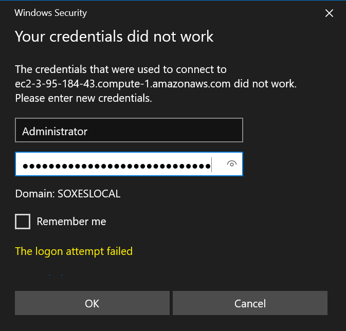
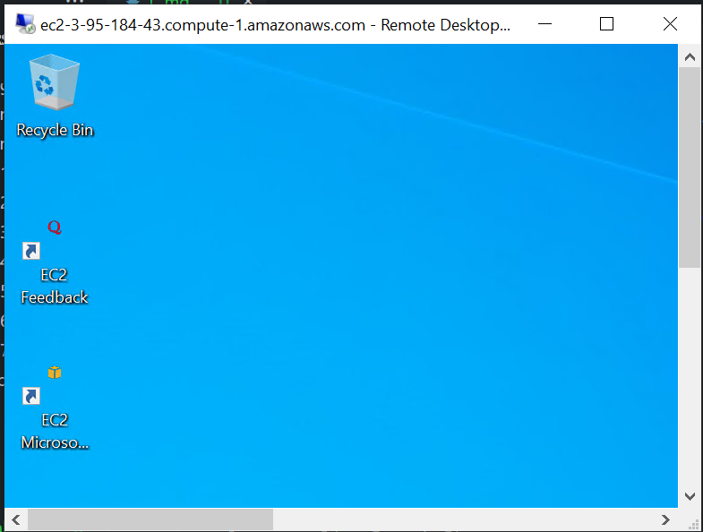
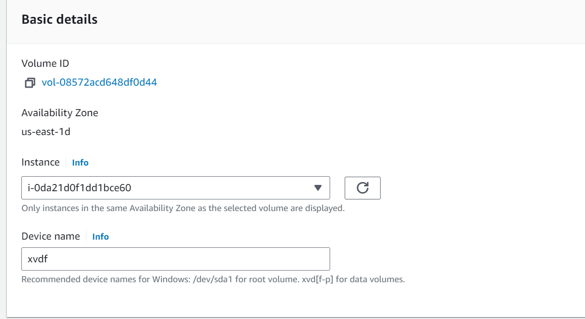
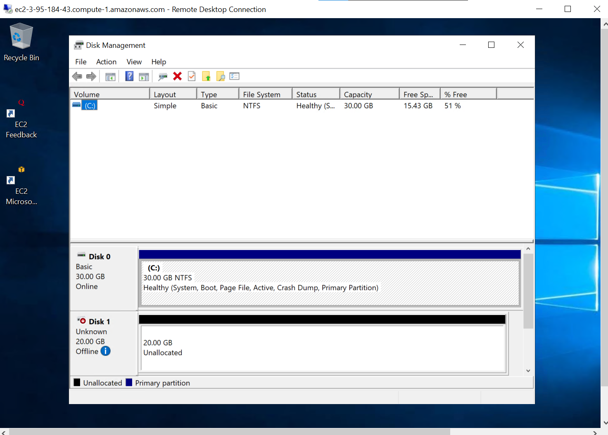
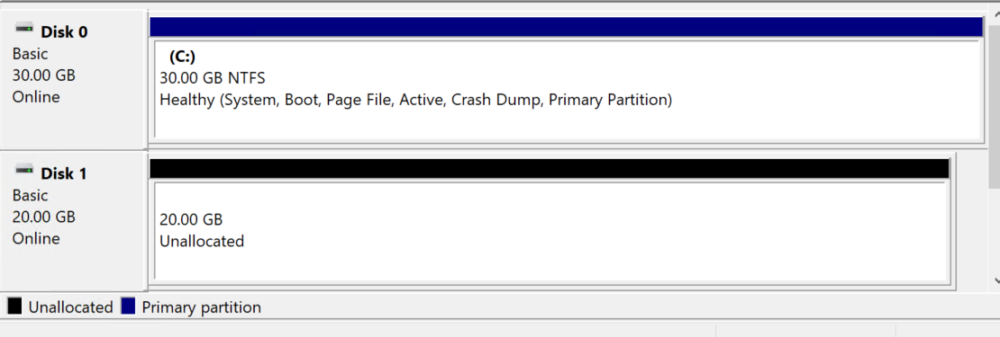
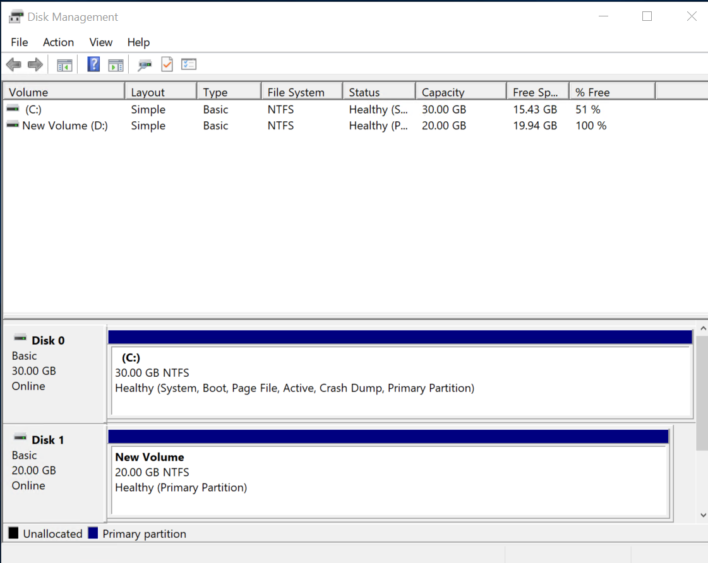

## RDP Rule
| Name                              | Security group rule ID       | IP version | Type         | Protocol | Port range | Source                                | Description      |
| --------------------------------- | ---------------------------- | ---------- | ------------ | -------- | ---------- | ------------------------------------- | ---------------- |
|                                   | sgr-071cfe7b15a1cd6cc       | IPv4       | RDP          | TCP      | 3389       | 0.0.0.0/0                             |                  |
|                                   | sgr-0fcbd1c1747e27a84       | –          | All traffic  | All      | All        | sg-04be2a1c8d16cce16 / default        |                  |

## Decrypt password
- .pem file hochladen
  

password: qr4EilQ6sA797ZGKL$sww(?(Vk&KWPB(
instance id: i-0da21d0f1dd1bce60
dns: ec2-3-95-184-43.compute-1.amazonaws.com

- Anderen User verwenden und Administrator benutzen

- Beweis dass VM läuft

## Volume id
vol-05651eb7c9a3efd8a

## attach Volume
- wichtig, nach Erstellen des Volume einmal reload, damit man volume attachen kann -> das volume soll die Instanz sein. 
- ebenfalls soll das Volume in der gleichen AZ sein.

## Auf der Instanz das Volume nachschauen

- offline

- online

## simple Volume formatiert Disk D

## Ordner erstellt auf dem Disk D
