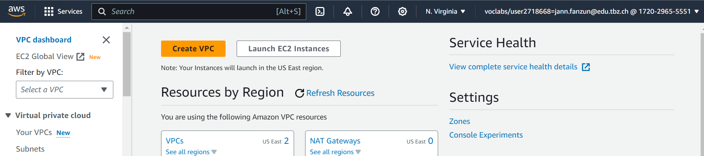
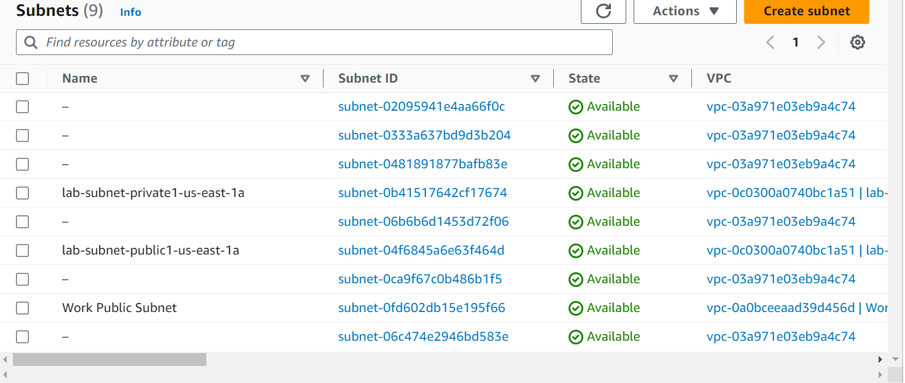
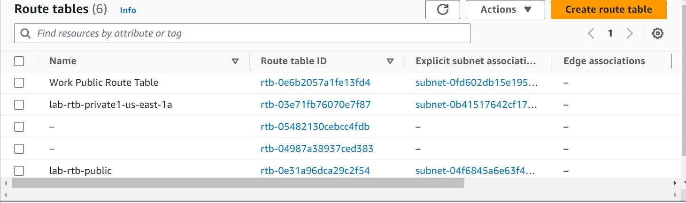
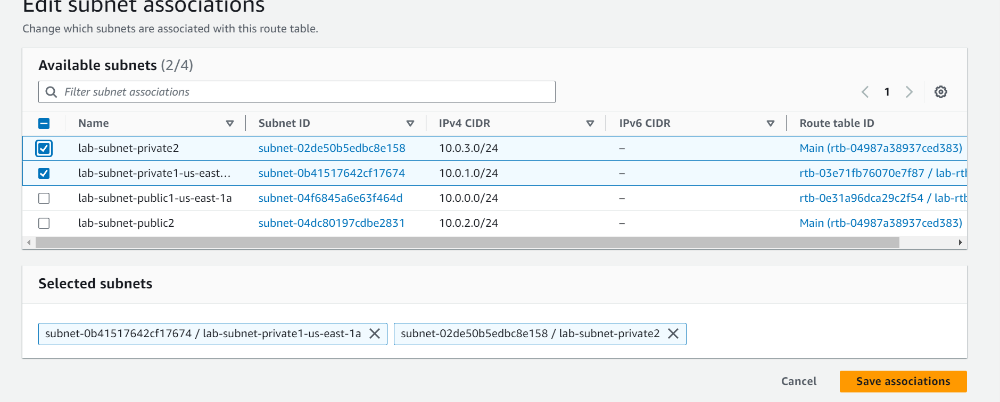
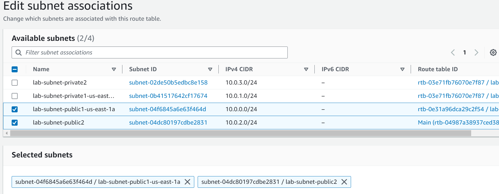
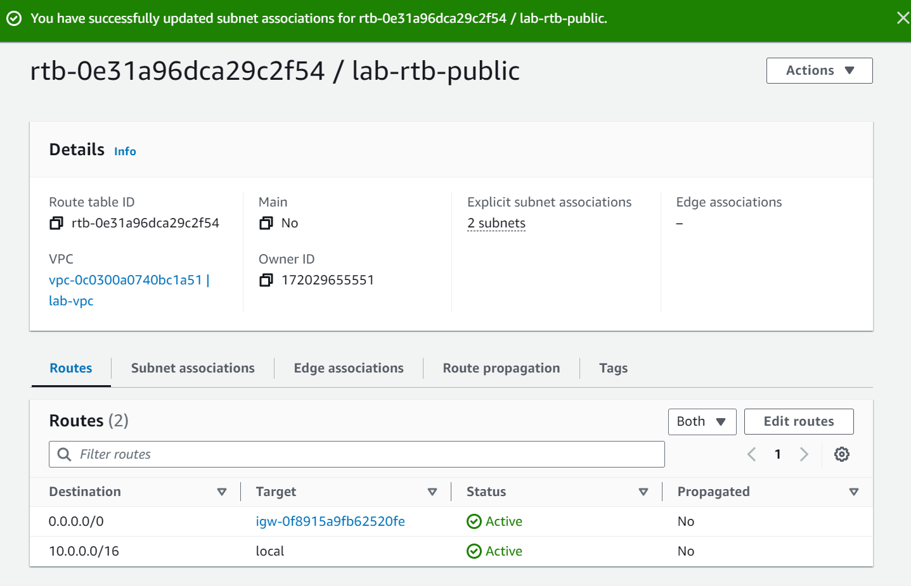
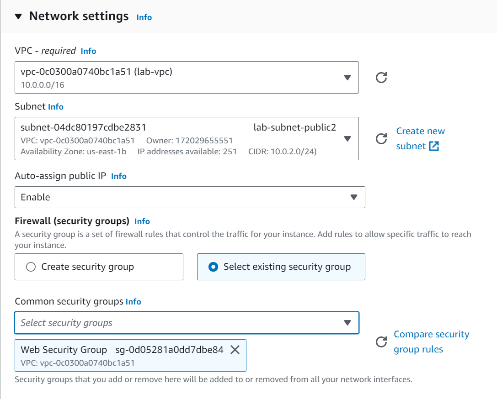
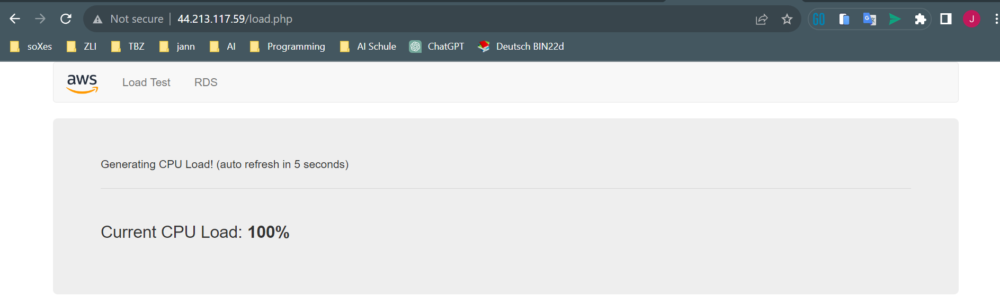

## public subnet erstellen
| Name                   | Subnet ID                      | State     | VPC                              | IPv4 CIDR     | IPv6 CIDR | Available IPv4 addresses | Availability Zone | Availability Zone ID | Network border group | Route table         | Network ACL         | Default subnet | Auto-assign public IPv4 address | Auto-assign customer-owned IPv4 address | Customer-owned IPv4 pool | Auto-assign IPv6 address | Owner ID       |
|------------------------|--------------------------------|-----------|----------------------------------|---------------|-----------|---------------------------|--------------------|----------------------|----------------------|---------------------|---------------------|----------------|--------------------------------|----------------------------------------|--------------------------|-------------------------|----------------|
| lab-subnet-public2     | subnet-04dc80197cdbe2831       | Available | vpc-0c0300a0740bc1a51 | 10.0.2.0/24  | –         | 251                       | us-east-1b         | use1-az1             | –                    | rtb-04987a38937ced383 | acl-0ee54cc46d45b2801 | No             | No                             | No                                     | No                       | -                       | No             | 172029655551  |

## private subnet erstellen
| Name                   | Subnet ID                      | State     | VPC                              | IPv4 CIDR     | IPv6 CIDR | Available IPv4 addresses | Availability Zone | Availability Zone ID | Network border group | Route table         | Network ACL         | Default subnet | Auto-assign public IPv4 address | Auto-assign customer-owned IPv4 address | Customer-owned IPv4 pool | Auto-assign IPv6 address | Owner ID       |
|------------------------|--------------------------------|-----------|----------------------------------|---------------|-----------|---------------------------|--------------------|----------------------|----------------------|---------------------|---------------------|----------------|--------------------------------|----------------------------------------|--------------------------|-------------------------|----------------|
| lab-subnet-public2     | subnet-04dc80197cdbe2831       | Available | vpc-0c0300a0740bc1a51 | 10.0.2.0/24  | –         | 251                       | us-east-1b         | use1-az1             | –                    | rtb-04987a38937ced383 | acl-0ee54cc46d45b2801 | No             | No                             | No                                     | No                       | -                       | No             | 172029655551  |
| lab-subnet-private2    | subnet-02de50b5edbc8e158       | Available | vpc-0c0300a0740bc1a51 | 10.0.3.0/24  | –         | 251                       | us-east-1b         | use1-az1             | –                    | rtb-04987a38937ced383 | acl-0ee54cc46d45b2801 | No             | No                             | No                                     | No                       | -                       | No             | 172029655551  |

## subnet private association


| Name                   | Route table ID               | Explicit subnet associations | Edge associations | Main | VPC                              | Owner ID       |
|------------------------|-----------------------------|-----------------------------|-------------------|------|----------------------------------|----------------|
| Work Public Route Table| rtb-0e6b2057a1fe13fd4       | subnet-0fd602db15e195f66 / Work Public Subnet | – | No   | vpc-0a0bceeaad39d456d | 172029655551  |
| lab-rtb-private1-us-east-1a| rtb-03e71fb76070e7f87    | 2 subnets                  | –                 | No   | vpc-0c0300a0740bc1a51 | 172029655551  |
| -                      | rtb-05482130cebcc4fdb       | –                          | –                 | Yes  | vpc-0a0bceeaad39d456d | 172029655551  |
| -                      | rtb-04987a38937ced383       | –                          | –                 | Yes  | vpc-0c0300a0740bc1a51 | 172029655551  |
| lab-rtb-public         | rtb-0e31a96dca29c2f54       | subnet-04f6845a6e63f464d / lab-subnet-public1-us-east-1a | – | No   | vpc-0c0300a0740bc1a51 | 172029655551  |
| -                      | rtb-06a1e9f99de8b05e2       | –                          | –                 | Yes  | vpc-03a971e03eb9a4c74 | 1720296       |

## subnet public association





## security group erstellen

| Name | Security group rule ID | IP version | Type | Protocol | Port range | Source      | Description         |
|------|------------------------|------------|------|----------|------------|-------------|---------------------|
| -    | sgr-039280189018708b1  | IPv4       | HTTP | TCP      | 80         | 0.0.0.0/0  | Permit web request |

## EC2

### ec2 network settings



### advanced details

```php
#!/bin/bash
# Install Apache Web Server and PHP
dnf install -y httpd wget php mariadb105-server
# Download Lab files
wget https://aws-tc-largeobjects.s3.us-west-2.amazonaws.com/CUR-TF-100-ACCLFO-2/2-lab2-vpc/s3/lab-app.zip
unzip lab-app.zip -d /var/www/html/
# Turn on web server
chkconfig httpd on
service httpd start
```

This script will run with root user permissions on the guest OS of the instance. It will run automatically when the instance launches for the first time. The script installs a web server, a database, and PHP libraries, and then it downloads and installs a PHP web application on the web server.  

### all instances

| Name          | Instance ID                | Instance state | Instance type | Status check       | Alarm status | Availability Zone | Public IPv4 DNS                                   | Public IPv4 address | Elastic IP | IPv6 IPs | Monitoring | Security group name   | Key name | Launch time              | Platform details |
|---------------|---------------------------|----------------|---------------|--------------------|--------------|-------------------|---------------------------------------------------|---------------------|------------|----------|------------|-----------------------|----------|--------------------------|------------------|
| Bastion Host  | i-04e9f536123fcba86       | Running        | t2.micro      | 2/2 checks passed | No alarms    | us-east-1a        | ec2-54-146-53-125.compute-1.amazonaws.com       | 54.146.53.125       | –          | –        | disabled   | Ec2SecurityGroup      | vockey   | 2023/10/06 09:04 GMT+2  | Linux/UNIX       |
| Web Server 1  | i-08ffbb9cc7edc5f6d       | Running        | t2.micro      | 2/2 checks passed | No alarms    | us-east-1b        | ec2-44-213-117-59.compute-1.amazonaws.com       | 44.213.117.59       | –          | –        | disabled   | Web Security Group    | vockey   | 2023/10/06 09:55 GMT+2  | Linux/UNIX       |

## open ec2 in web

**Public IPv4 address
 44.213.117.59**

 

 ### load test

