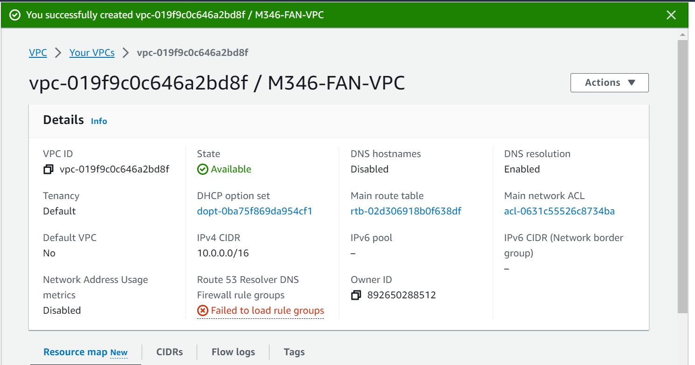
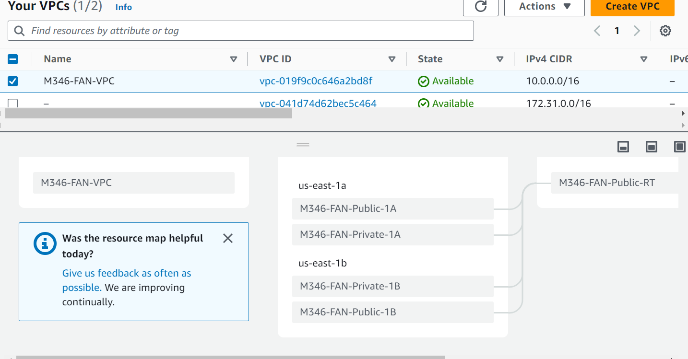
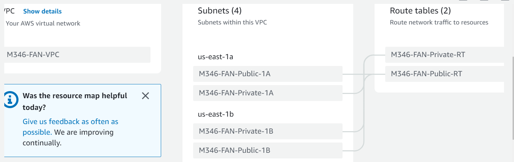
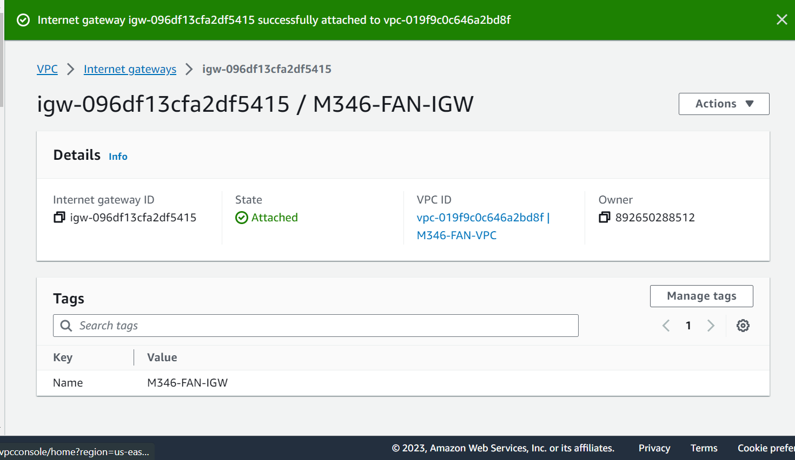
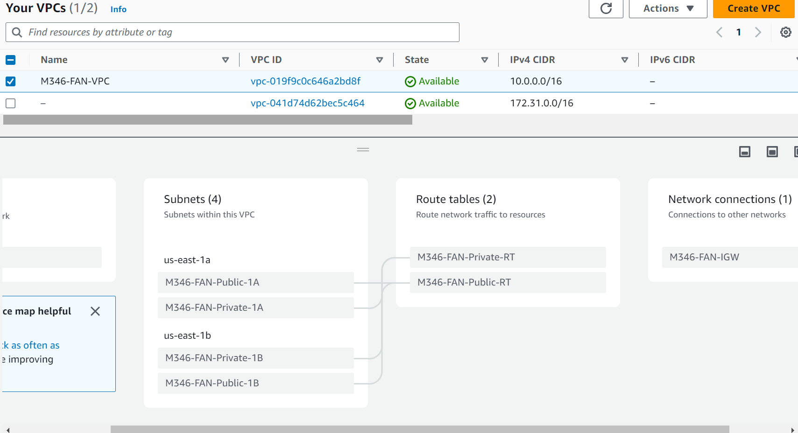
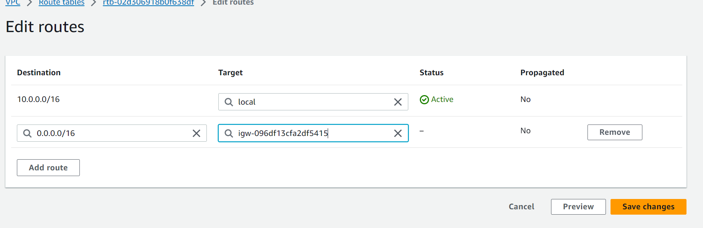
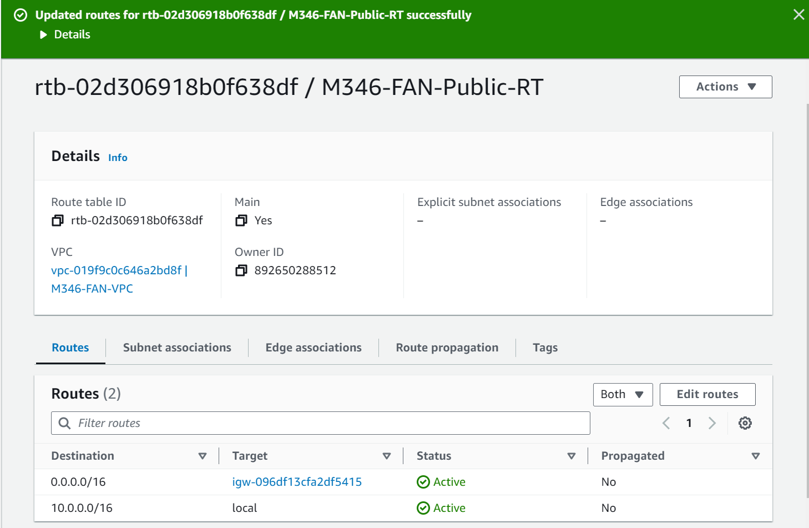

Diese VPC (eigentlich vergleichbar mit einem virtuellen Datacenter) wird so konfiguriert, dass Sie in der nächsten Übung Instanzen im Public und im Privaten Subnet erstellen können. Während die eine Instanz von aussen zugänglich ist, kann die interne nur über die interne Adresse erreicht werden. Sie nutzen dafür ihre Subnet-Kenntnisse von früheren Modulen und Labs. Wie bereits im ersten KN05-Lab, erstellen Sie in Ihrer neuen VPC also ebenfalls eine eigene Route-Table für die privaten Subnetze (interner Datenverkehr) und einen Internet-Gateway für die public Subnetze (Zugang von und nach aussen).

## VPC erstellt

## Subnetze erstellen

- 2x Private
- 2x Public

| Name | Subnet ID | State | VPC | IPv4 CIDR | IPv6 CIDR | Available IPv4 addresses | Availability Zone | Availability Zone ID | Network border group | Route table | Network ACL | Default subnet | Auto-assign public IPv4 address | Auto-assign customer-owned IPv4 address | Customer-owned IPv4 pool | Auto-assign IPv6 address | Owner ID |
|------|-----------|-------|-----|-----------|-----------|---------------------------|-------------------|----------------------|----------------------|-------------|-------------|----------------|--------------------------------|----------------------------------------|--------------------------|-------------------------|----------------|
| -    | subnet-0059b527ee4fb200b | Available | vpc-041d74d62bec5c464 | 172.31.32.0/20 | – | 4091 | us-east-1b | use1-az6 | us-east-1 | rtb-0a8f5bdc9f79ce6e2 | acl-02d15acda6b7556e1 | Yes | Yes | No | - | No | 892650288512 |
| M346-FAN-Private-1B | subnet-04b4ed01dc3562a1e | Available | vpc-019f9c0c646a2bd8f | M346-FAN-VPC | 10.0.4.0/24 | – | 251 | us-east-1b | use1-az6 | us-east-1 | rtb-02d306918b0f638df | acl-0631c55526c8734ba | No | No | No | - | No | 892650288512 |
| M346-FAN-Public-1A | subnet-0e4665b209c5cc5b6 | Available | vpc-019f9c0c646a2bd8f | M346-FAN-VPC | 10.0.1.0/24 | – | 251 | us-east-1a | use1-az4 | us-east-1 | rtb-02d306918b0f638df | acl-0631c55526c8734ba | No | No | No | - | No | 892650288512 |
| -    | subnet-067488862fd83ab05 | Available | vpc-041d74d62bec5c464 | 172.31.80.0/20 | – | 4091 | us-east-1d | use1-az2 | us-east-1 | rtb-0a8f5bdc9f79ce6e2 | acl-02d15acda6b7556e1 | Yes | Yes | No | - | No | 892650288512 |
| M346-FAN-Private-1A | subnet-028de83f5078c813c | Available | vpc-019f9c0c646a2bd8f | M346-FAN-VPC | 10.0.3.0/24 | – | 251 | us-east-1a | use1-az4 | us-east-1 | rtb-02d306918b0f638df | acl-0631c55526c8734ba | No | No | No | - | No | 892650288512 |
| -    | subnet-04bf30efd9c22775f | Available | vpc-041d74d62bec5c464 | 172.31.64.0/20 | – | 4091 | us-east-1f | use1-az5 | us-east-1 | rtb-0a8f5bdc9f79ce6e2 | acl-02d15acda6b7556e1 | Yes | Yes | No | - | No | 892650288512 |
| -    | subnet-0110f82d81f3b44c5 | Available | vpc-041d74d62bec5c464 | 172.31.0.0/20 | – | 4091 | us-east-1c | use1-az1 | us-east-1 | rtb-0a8f5bdc9f79ce6e2 | acl-02d15acda6b7556e1 | Yes | Yes | No | - | No | 892650288512 |
| -    | subnet-04b1eba42cd039c4b | Available | vpc-041d74d62bec5c464 | 172.31.48.0/20 | – | 4091 | us-east-1e | use1-az3 | us-east-1 | rtb-0a8f5bdc9f79ce6e2 | acl-02d15acda6b7556e1 | Yes | Yes | No | - | No | 892650288512 |
| -    | subnet-0fbaae1c248271dc7 | Available | vpc-041d74d62bec5c464 | 172.31.16.0/20 | – | 4091 | us-east-1a | use1-az4 | us-east-1 | rtb-0a8f5bdc9f79ce6e2 | acl-02d15acda6b7556e1 | Yes | Yes | No | - | No | 892650288512 |
| M346-FAN-Public-1B | subnet-0d731afabda00f4b7 | Available | vpc-019f9c0c646a2bd8f | M346-FAN-VPC | 10.0.2.0/24 | – | 251 | us-east-1b | use1-az6 | us-east-1 | rtb-02d306918b0f638df | acl-0631c55526c8734ba | No | No | No | - | No | 892650288512 |

## VPC Route Map

## Route Table Private mit Subnet

## VPC

## Internet GateWay mit VPC

## VPC kontrollieren

## Hinzufügen von Routes

Kontrollieren wir kurz die aktualisierte Resource map. Hier sieht man jetzt, dass der Internet gateway (IGW) neu auch mit der Public route M346-XXX-Public-RT verbunden ist. Der Zugang zum Internet ist somit hergestellt. Alle internen Pakete, die nicht an die eigene VPC (10.0.0.0/16) gerichtet sind, werden an den IGW weitergeroutet. Umgekehrt kann der IGW auch Pakete an unsere Public Subnets in unserer VPC routen, sofern die entsprechenden Regeln in der Security Group dies zulassen.

### Route attached

## VPC RT und Network Connections

