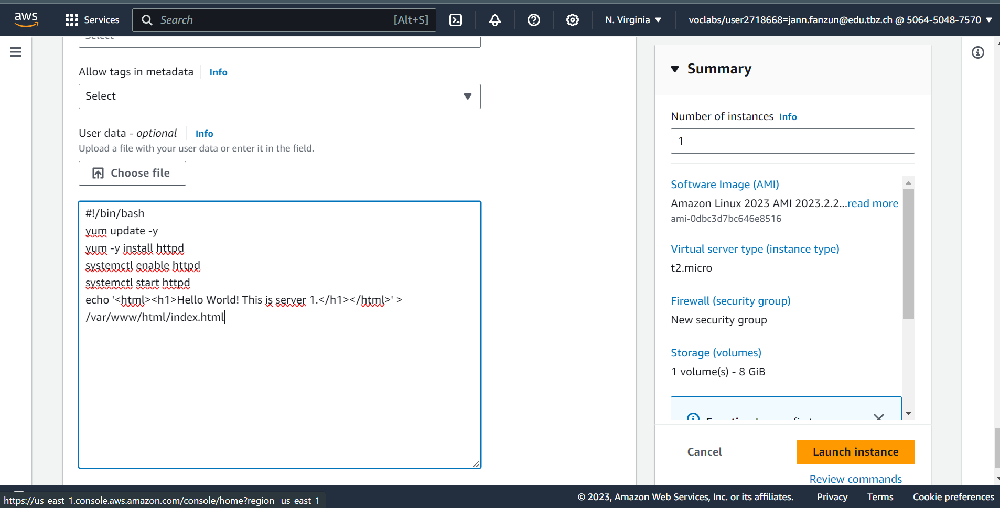
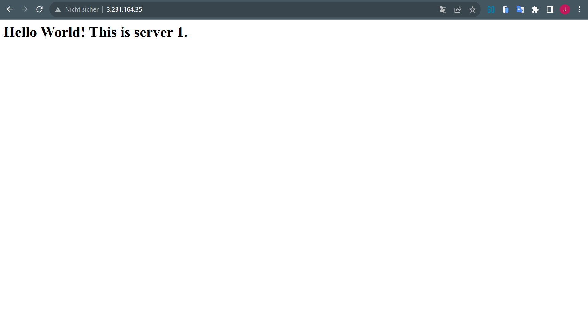
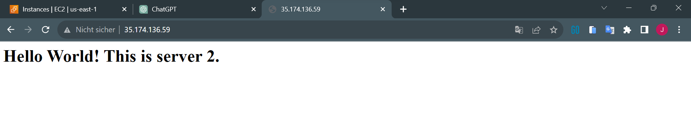
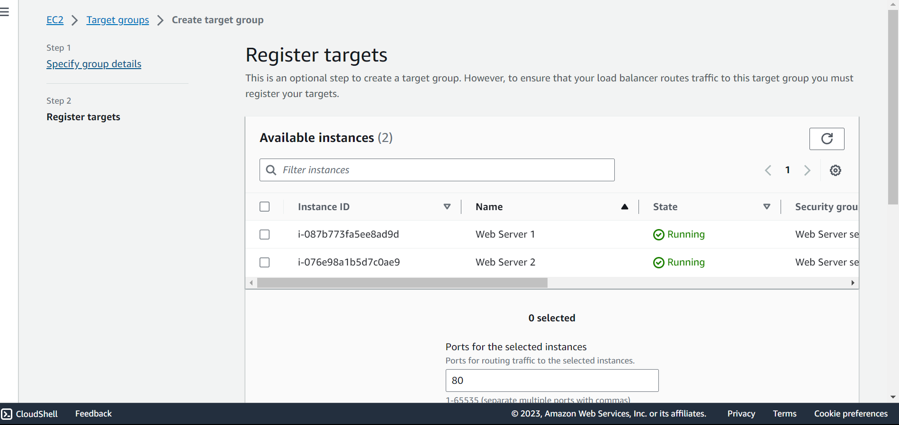
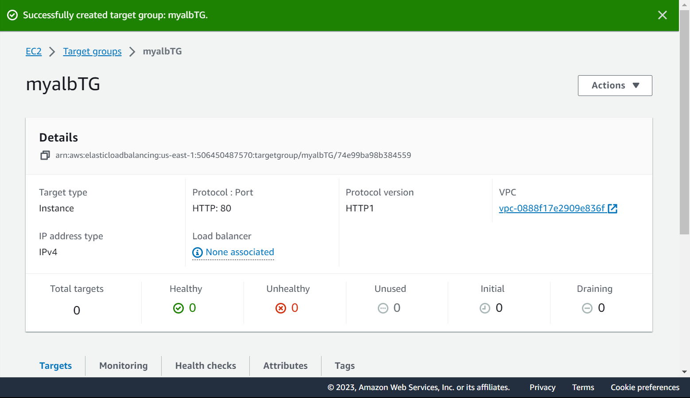
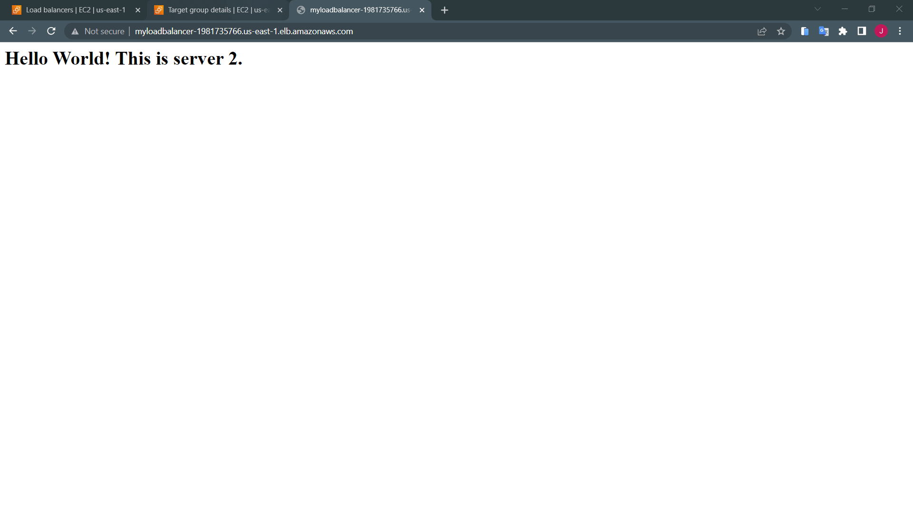

## EC2 Instanz
- Amazon Linux
- t2.micro
- KeyPair: vockey
**Network Settings**
- Availibility Zone: us-east-1a
- Add Security Group Rule
  - Type : HTTP
  - Source type : Anywhere




```javascript
#!/bin/bash
yum update -y
yum -y install httpd
systemctl enable httpd
systemctl start httpd
echo '<html><h1>Hello World! This is server 1.</h1></html>' > /var/www/html/index.html
```

Updates the server
Installs an Apache web server (https)
Configures the web server to automatically start on boot
Starts the web server
Creates a simple webpage 

### Access EC2 Instance Website

Server: 3.231.164.35 


## Create a second EC2 instance for load balancing

- Key Pair: vockey
- Zone: us-east-1b
- Advanced Details
```javascriipt
#!/bin/bash
yum update -y
yum -y install httpd
systemctl enable httpd
systemctl start httpd
echo '<html><h1>Hello World! This is server 2.</h1></html>' > /var/www/html/index.html
```

### Both Instances

| Name          | Instance ID         | Instance state | Instance type | Status check    | Alarm status | Availability Zone | Public IPv4 DNS                        | Public IPv4 address | Elastic IP | IPv6 IPs | Monitoring | Security group name     | Key name | Launch time              | Platform details | 
|--------------- |--------------------- |--------------- |-------------- |----------------- |------------- |------------------ |-------------------------------------- |-------------------- |------------|---------- |------------ |------------------------ |---------- |--------------------------- |----------------- | 
| Web Server 2  | i-076e98a1b5d7c0ae9 | Running        | t2.micro      | Initializing    | No alarms    | us-east-1b        | ec2-35-174-136-59.compute-1.amazonaws.com | 35.174.136.59      | –          | –        | disabled   | Web Server security group | vockey   | 2023/10/27 11:34 GMT+2 | Linux/UNIX       | 
| Web Server 1  | i-087b773fa5ee8ad9d | Running        | t2.micro      | 2/2 checks passed | No alarms    | us-east-1a        | ec2-3-231-164-35.compute-1.amazonaws.com  | 3.231.164.35       | –          | –        | disabled   | Web Server security group | vockey   | 2023/10/27 11:25 GMT+2 | Linux/UNIX       |

## Access Webserver 2



## Load Balancer
**Mappings**
- us-east-1a
- us-east-1b

**Security**
- Web Server Security Group

**target Group**
- in Health Check
  - /index.html

**register Target**
- select Web Server 1 & 2
- select include as pending below





## DNS Target Group Test


