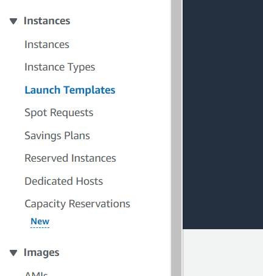
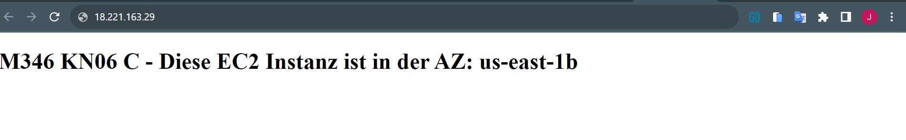
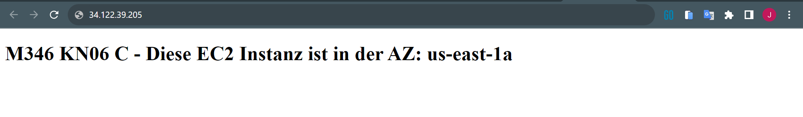

## Launch Template erstellen


- Danach auf "Startvorlage erstellen" klicken
**Folgende Daten eigeben:**
- Name: M346-FAN-WebAccess
- Betriebssystem: Amazon Linux 2
- Instanztyp: t2.micro
- Schlüsselpaar: Nicht in Startvorlage aufnehmen
- Netzwerkeinstellungen:
  - Subnetz: Nicht in Startvorlage aufnehmen
  - Sicherheitsgruppe: M346-FAN-WebAcc
- User Data:

```javascript
#!/bin/bash
yum update -y
yum install -y httpd
systemctl start httpd
systemctl enable httpd
EC2AZ=$(TOKEN=`curl -X PUT "http://169.254.169.254/latest/api/token" -H "X-aws-ec2-metadata-token-ttl-seconds: 21600"` && curl -H "X-aws-ec2-metadata-token: $TOKEN" -v http://169.254.169.254/latest/meta-data/placement/availability-zone)
echo '<center><h1 style="background-color:powderblue;">M346 KN06 C - Diese EC2 Instanz ist in der AZ: AZID </h1></center>' > /var/www/html/index.txt
sed "s/AZID/$EC2AZ/" /var/www/html/index.txt > /var/www/html/index.html
```

## Auto Scaling Group
- In der Linken Navigation unter "Auto Scaling" auf "Auto Scaling-Gruppen" klicken.
- Danach oben auf "Auto-Scaling-Gruppe erstellen" klicken.
- Folgende Daten eingeben:
  - **Name**: KN06_FAN_AutoScalingGroup
  - **Startvorlage**: M346-FAN-Template
  - Danach auf "weiter" klicken.
  - Folgende Daten eingeben und immer "weiter" klicken:
  - Netzwerk
    - VPC
    - Public us-east-1a
    - Public us-east-1b
- Groupsize
  - 2
  - 2
  - 2
- Danach auf "Auto-Scaling-Gruppe erstellen" klicken.
  

**Schlussendlich bei den Public Subnets noch "Public IP-v4" freischalten**

### Instanzen öffnen
- Funktioniert bei mir nicht -> den Grund kenne ich nicht :/
  