# Lab: EBS Volume erstellen, Snapshot ziehen und daraus neues Volume erzeugen

## Vorbereitung
- Es sind bereits 2 Instanzen erstellt
  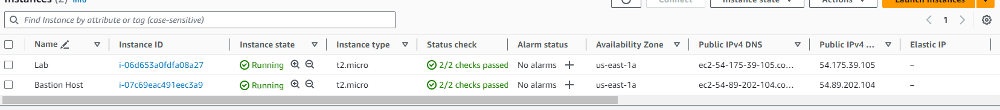

## Volume erstellen
- In der Navigationsbar auf "Volumes" klicken
- dann "create Volume" -> es sind ebenfalls bereits zwei erstellt
  - 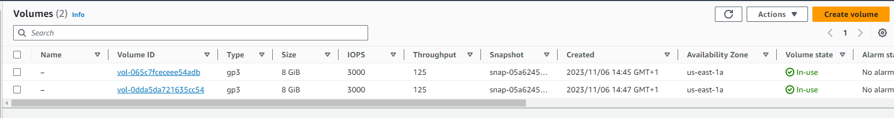
- Folgende Daten eingeben:
  - Volume-Typ: Allzweck-SSD (gp2)
  - Grösse (GiB): 1
  - Availablity Zone: us-east-1a
  - Tags:
    - Schlüssel: Name
    - Wert: My Volume
- 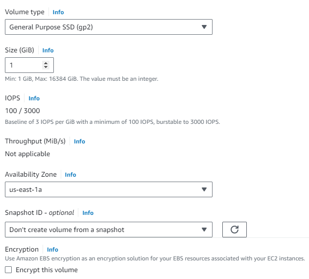
- 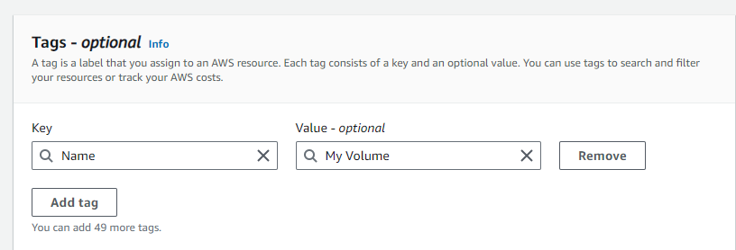
  
## Volume an Instanz anhängen
- Erstelltes Volume auswählen
- "Actions" klicken
- "attach Volume" auswählen
  - falls das nicht geht, Seite neu laden
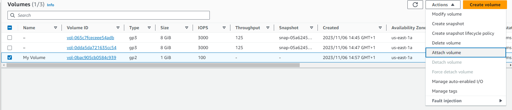
- Nun folgendes auswählen
  - Instanz: Lab
  - Gerätebezeichnung: /dev/sdf
  - 
- Anschliessend "Attach volume" klicken
  
## EC2 Instanz mit SSH verbinden
- PPK Datei downloaden
- in Putty einstellen, dass kein Timeout gibt
  - Conncetion -> Seconds between keepalives to 30
  - 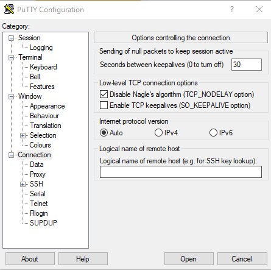
- In Session IP von Instanz mitgeben -> 54.175.39.105
- Danach auf "Connection/SSH/Auth/credentials" klicken
  - unter "private key file for authetication" PPK Datei einfügen
- open klicken
- accept 
- "ec2-user" anmelden
  - 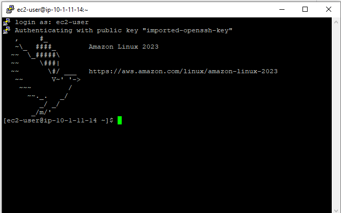

## Filesystem erstellen und konfigurieren
Nun werden Befehle im CMD eingegeben
---
storage on instance
```
df -h
```
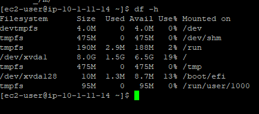
---
create ext3 file system on new volume
```
sudo mkfs -t ext3 /dev/sdf
```
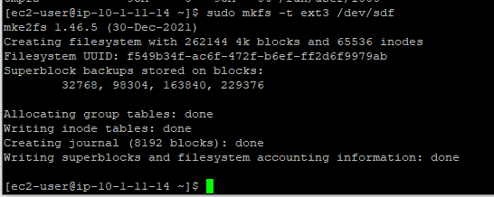
---
create a directory for mounting new storage volume
```
sudo mkdir /mnt/data-store
```
---
mount the new volume to created directory
```
sudo mount /dev/sdf /mnt/data-store
```
---
To configure the Linux instance to mount this volume whenever the instance is started, you will need to add a line to /etc/fstab.

```
echo "/dev/sdf   /mnt/data-store ext3 defaults,noatime 1 2" | sudo tee -a /etc/fstab 
```
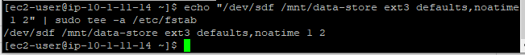
---
view configuration file
```
cat /etc/fstab
```
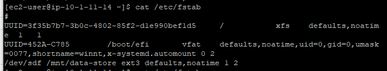
---
view available storage again

```
df -h
```
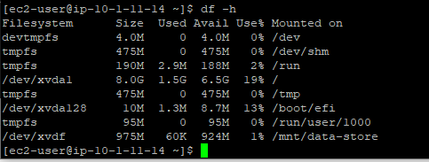
---
on mounted volume, create file and add text

```
sudo sh -c "echo some text has been written > /mnt/data-store/file.txt"
```
---
view text
```
cat /mnt/data-store/file.txt
```
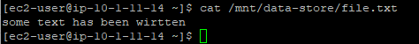
---

## Snapshot erstellen
- In der Linken Navigation unter "Elastic Block Store" auf "Volumes" klicken
- Danach auf das Volume (My Volume) anklicken
- Danach auf "Aktionen" klicken und auf "Snapshot erstellen" klicken
- Folgende Daten einfügen:
    - Tags:
      - Schlüssel: Name
      - Wert: My Snapshot
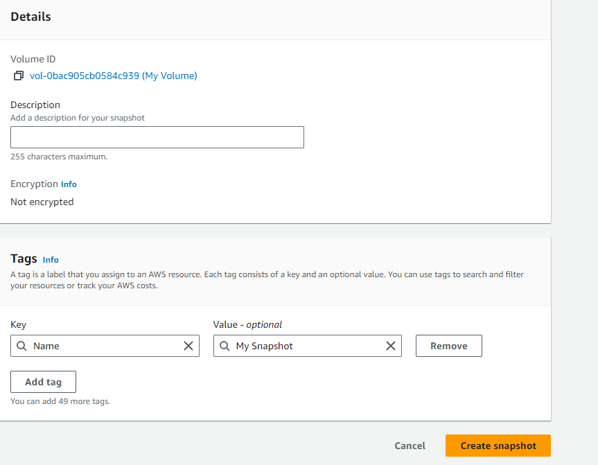
- Danach auf "Snapshot erstellen" klicken
- In der SSH Session folgende Befehle eingeben:
---
File löschen 
```
sudo rm /mnt/data-store/file.txt
```
---
überprüfen ob File gelöscht wurde
```
ls /mnt/data-store/
```
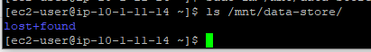

## Snapshot wiederherstellen
- In der Linken Navigation unter "Elastic Block Store" auf "Snapshots" klicken
- Danach auf das Snapshot (My Snapshot) anklicken
- Danach auf "Aktionen" klicken und auf "Volume aus Snapshot erstellen" klicken:
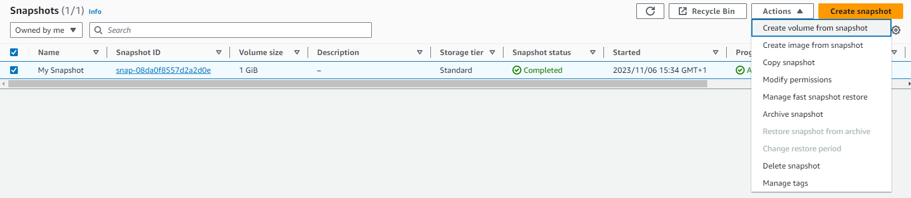
- folgendes einfügen
- 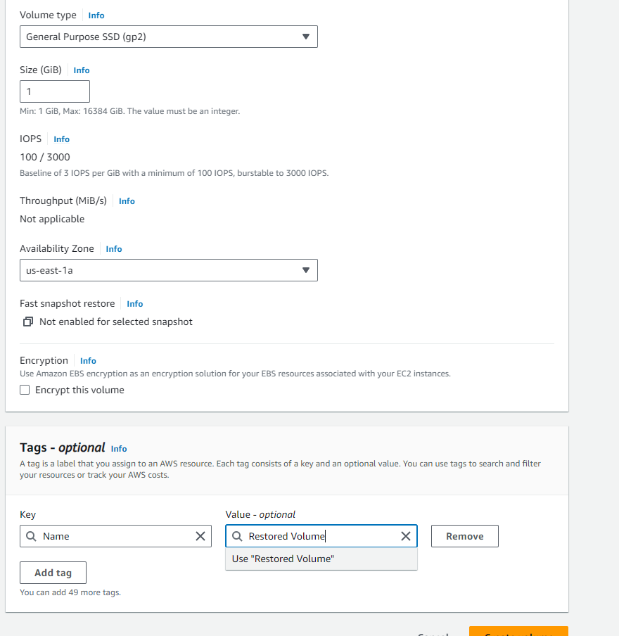

## restored Volume zur EC2 anhängen

- in volumes
- restored volume auswählen
- actions
- attach volume
- 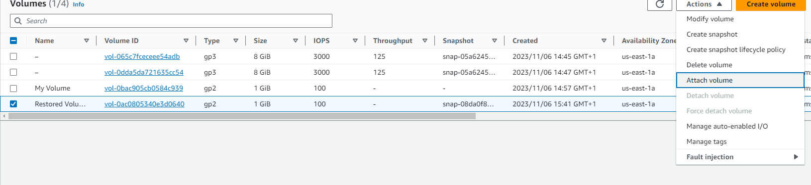
- Instanz "Lab" auswählen
- 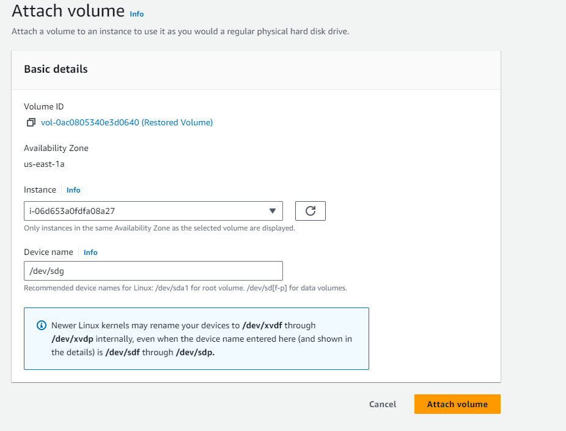

## Mount restored volume
Erstellen eines Verzeichnisses zum Einbinden des neuen Datenträgers
```
sudo mkdir /mnt/data-store2
```
---
das volume mounten
```
sudo mount /dev/sdg /mnt/data-store2
```
---
Überprüfen, ob das File wiederhergestellt wurde:

```
ls /mnt/data-store2/
```
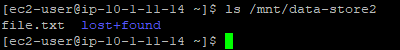